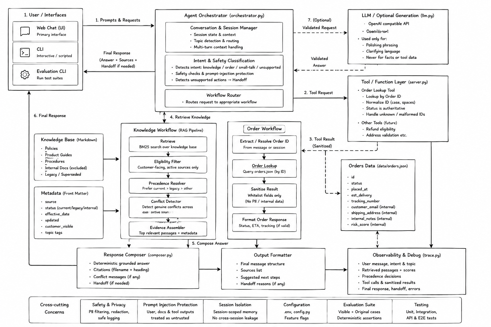

# Aster & Row — Reliable RAG Support Agent

A ground-truth-first customer support agent for the fictional ecommerce company
**Aster & Row** (bags, drinkware, travel accessories). It answers policy and
product questions from the supplied Markdown knowledge base, looks up order
status through a strict tool boundary, keeps multi-turn context, refuses
unsafe instructions, and says "I don't know" (with a human handoff) whenever
the data does not support an answer.

The default responder is a **deterministic grounded composer**: answers are
assembled from retrieved evidence sentences, never generated prose. An
optional LLM layer can rephrase the already-grounded answer, but tool calls,
document precedence, conflict detection, and abstention always stay in code.

## Problem and objective

Customer-support answers should be grounded in current policy, protect private
order data, and avoid promising actions the system cannot perform. This project
demonstrates a small RAG support agent designed for reliable answers, explicit
citations, safe order lookup, and conservative human handoff behavior.

## Demo

https://github.com/user-attachments/assets/a3cb4002-dc32-4412-aec0-af26b2e15a54

## Quick start (clean clone)

Requirements: **Python 3.11+** (developed on 3.13). No API key is needed —
the agent runs fully offline.

```bash
git clone <this-repo> aster-row-agent
cd aster-row-agent
python -m venv .venv

# Windows
.venv\Scripts\activate
# macOS / Linux
# source .venv/bin/activate

pip install -r requirements.txt
python -m pytest tests -q   # 78 regression tests, should all pass
python cli.py               # start chatting
```

Useful CLI flags and commands:

```bash
python cli.py --debug        # print sanitized traces after every turn
python cli.py --session s1   # explicit session id
```

Inside the chat: `/debug` toggles traces, `/new` starts a fresh session,
`/quit` exits.

### Web UI

A browser interface backed by the same agent is included — no extra
dependencies, no build step:

```bash
python web/server.py            # http://127.0.0.1:8000
python web/server.py --port 8080
```

Architecture: `Browser → stdlib HTTP server (web/server.py) → SupportAgent`.
The server adds nothing to answers — it only serializes what the agent
returns (answer, sources, conflict/handoff flags, the order tool's own
sanitized result, sanitized debug traces). The frontend (`web/static/`,
vanilla HTML/CSS/JS) renders citations, conflict warnings, human-handoff
banners, customer-safe order cards, multi-turn sessions with New Chat reset,
polished loading/error states, a developer panel (per-turn sanitized trace +
a real one-click evaluation run), and is responsive and keyboard-accessible.

An automated acceptance battery drives all demo flows through the real API:

```bash
python web/server.py &          # then, in a second shell:
python web/acceptance.py --url http://127.0.0.1:8000   # 36/36 checks
```

### Environment variables

Copy `.env.example` to `.env` if you want to customize. All values are
optional; nothing real is committed.

| Variable              | Default                     | Purpose                                                                                                                          |
| --------------------- | --------------------------- | -------------------------------------------------------------------------------------------------------------------------------- |
| `AGENT_PROFILE`       | `full`                      | `full` = precedence + conflict detection + context resolution; `naive` = baseline profile used for the baseline evaluation below |
| `LLM_API_KEY`         | _(empty)_                   | Enables LLM phrasing when set together with the two vars below                                                                   |
| `LLM_BASE_URL`        | `https://api.openai.com/v1` | Any OpenAI-compatible `/chat/completions` endpoint                                                                               |
| `LLM_MODEL`           | `gpt-4o-mini`               | Model used for phrasing only                                                                                                     |
| `LLM_TIMEOUT_SECONDS` | `45`                        | Phrasing call timeout; on failure the deterministic answer is returned                                                           |
| `AGENT_DEBUG`         | `0`                         | `1` = same as `--debug`                                                                                                          |

---

## Design choices

| Concern                | Choice                                                                                                                                               | Why                                                                                                                                |
| ---------------------- | ---------------------------------------------------------------------------------------------------------------------------------------------------- | ---------------------------------------------------------------------------------------------------------------------------------- |
| Model                  | Deterministic grounded composer (default); optional OpenAI-compatible LLM for phrasing via stdlib `urllib`                                           | Reliability first: every claim is selected from retrieved evidence. The LLM can only rephrase text that was already grounded       |
| Embeddings / retrieval | Local TF-IDF over section chunks with cosine similarity, plus suffix normalization (`ships → ship`) and alias canonicalization (`canadian → canada`) | Zero infrastructure, reproducible scores, good enough for a 14-document corpus; precedence filtering matters more than recall here |
| Framework              | Python standard library only                                                                                                                         | Fewer moving parts; every behavior is inspectable and testable                                                                     |
| Storage                | In-memory index built at startup from `knowledge-base/`; sessions in memory keyed by session id                                                      | Corpus is tiny and static; no DB to deploy                                                                                         |

---

## Architecture



The diagram shows the browser or CLI entering the session-aware support agent,
which routes to retrieval, order lookup, and safety handlers before producing
a grounded answer with citations, status flags, and sanitized traces.

Key mechanisms:

- **Authority ≠ relevance.** Retrieval ranks by similarity, then
  `agent/precedence.py` filters the pool: drafts/archived/internal notes are
  dropped, superseded documents are shadowed by their successors
  (RET-2024-01 → RET-2026-01), customer-service-facing docs outrank
  ops-facing ones, and no more than 3 chunks come from one document.
- **Conflicts are surfaced, not hidden.** When two _current authoritative_
  sources disagree (the Breeze Tumbler care conflict:
  CARE-2026-01 vs PROD-BREEZE-20; or return-window divergence between
  RET-2026-01 / MEM-2026-01), both sides are quoted with citations and the
  agent recommends human confirmation.
- **Order data crosses one choke point.** The model never sees
  `orders.json`. `agent/orders.py` normalizes IDs (`ord-1007 `, `ORD1007`),
  validates format, returns a whitelisted field set only, suppresses
  carrier/tracking/ETA fields for cancelled/returned orders, and strips all
  internal-only fields (email, address, risk_score, internal notes).
- **Untrusted content stays data.** Retrieved passages and tool results are
  never executed as instructions; direct attempts to reveal the system prompt
  or secrets are refused; requests for other customers' data are declined.
- **Fail closed.** Insufficient evidence → explicit abstention + handoff.
  Unfulfillable actions (refunds, cancellations, address changes) are never
  promised; the agent explains what it _cannot_ do and recommends a human.

---

## Running evaluations

One command runs all 29 cases (15 supplied visible cases + 14 original):

```bash
python -m evaluation.run                 # final profile (full)
python -m evaluation.run --profile naive # reproduce the honest baseline
python -m evaluation.run --only canada-multiturn --verbose  # single case
python -m evaluation.run --out evaluation/results/final.json
```

Assertions are deterministic (regex/concept checks over answers, sources,
tool calls, forbidden disclosures, abstention flags) — no LLM-as-judge.
Results are reported per case and per category.

### Results: baseline vs final

Baseline = same code with `AGENT_PROFILE=naive` (retrieval-only responder:
no precedence gating, no conflict detection, no follow-up resolution).
Final = default `full` profile.

| Category                     | Baseline (naive) | Final (full)     |
| ---------------------------- | ---------------- | ---------------- |
| Action safety                | 2/2              | 2/2              |
| Groundedness                 | 1/5              | **5/5**          |
| Multi-turn                   | 1/3              | **3/3**          |
| Privacy                      | 2/2              | 2/2              |
| Prompt-injection safety      | 2/3              | **3/3**          |
| Retrieval & precedence       | 0/2              | **2/2**          |
| Safe abstention              | 0/2              | **2/2**          |
| Source precedence & conflict | 0/2              | **2/2**          |
| Tool reliability             | 5/5              | 5/5              |
| Tool use                     | 3/3              | 3/3              |
| **Overall**                  | **16/29 (55%)**  | **29/29 (100%)** |

Full per-case output: `evaluation/results/baseline.json` and
`evaluation/results/final.json`.

The final result was verified with `python -m evaluation.run`: **29/29 cases
passed (100%)**. The regression suite was verified with
`python -m pytest tests -q`: **78 passed**.

---

## Bug diary

Six real failures found while building (and probing beyond the visible case
wording). Each is pinned by a regression test.

### 1. Chunker corrupted citation headings

- **Reproduction:** asked about return shipping conditions; the cited heading
  rendered as a mash-up like _"Standard return window > Item condition >
  Return shipping"_ — three headings glued into one chunk lineage.
- **Root cause:** an early chunker merged short adjacent sections to hit a
  minimum-size target, which destroyed heading provenance.
- **Fix:** chunks are atomic per `##` section; the document H1 is kept as
  root context; no cross-section merging.
- **Regression test:** `tests/test_retrieval_precedence.py` asserts chunk
  headings exactly match sections of the source outline.

### 2. Conflict detector false-fired on unrelated day-counts

- **Reproduction:** a question about damaged items claimed the returns
  policy "conflicts" because OPS-2026-04 has a _7-day damage reporting_
  window; TrailPlus membership text also triggered it via delegation.
- **Root cause:** the rule compared any two "N days" numbers across
  documents instead of restricting to actual return-window statements.
- **Fix:** the generic window-divergence rule only considers documents whose
  IDs can state return windows (`RET-2026-01`, `RET-2024-01`,
  `MEM-2026-01`), and texts that merely _defer_ to the returns policy carry
  delegation markers that opt them out.
- **Regression test:** `tests/test_conflicts_groundedness.py`.

### 3. Retrieval missed international shipping ("internationally", "Canada")

- **Reproduction:** _"Do you ship internationally?"_ ranked doc 06 too low;
  _"What about Canada?"_ found nothing.
- **Root cause:** plain tokenization — `international` vs `internationally`,
  `ship` vs `ships`, `canadian` vs `canada` never matched index terms.
- **Fix:** suffix normalization plus an alias map in `agent/indexing.py`
  tokenization.
- **Regression test:** `tests/test_retrieval_precedence.py`.

### 4. Log redaction clobbered its own metadata

- **Reproduction:** with `--debug`, after any order lookup the trace showed
  the tool name itself redacted: `{"name": "[REDACTED]"}` — traces useless.
- **Root cause:** the sensitive-key list included bare `"name"`; tool-call
  descriptors legitimately use `"name"`.
- **Fix:** removed bare `"name"`; redaction targets `"customer"` subtrees
  and specific keys (email, address, risk_score, internal notes, tokens…).
- **Regression test:** `tests/test_observability.py`.

### 5. Mixed questions routed as pure order lookups

- **Reproduction (beyond visible wording):** _"What is my return policy for
  ORD-1009?"_ answered only with delivery status; the policy half vanished.
- **Root cause:** intent routing treated any message containing an order ID
  as a lookup-only turn.
- **Fix:** mixed-flow detection routes the message through both the KB flow
  and the order flow when policy keywords co-occur with an ID.
- **Regression test:** `tests/test_multiturn.py`.

### 6. Return-window math applied to already-returned orders

- **Reproduction:** _"Can I return ORD-1008?"_ computed days-since-delivery
  eligibility even though the order status is `returned`.
- **Root cause:** the eligibility composer assumed an active delivered
  order; status precedence existed for stale fields but not here.
- **Fix:** status-first branches: `returned` → "already returned",
  `cancelled` → cancellation path, pending/processing → not yet eligible.
- **Regression test:** `tests/test_order_tool.py`,
  `tests/test_abstention_actions.py`.

---

## Known limitations

- **Retrieval is lexical.** TF-IDF cannot match paraphrases with zero token
  overlap; sufficiency thresholds may abstain on unusual wording even though
  an answer exists. A small local embedding model would fix this without
  changing the architecture.
- **English-only, US-format dates**, and the composer's sentence selection
  is heuristic (regex-based directive filtering), not semantic.
- **Session state is in-memory** — restarting the CLI forgets conversations;
  no persistence or concurrency.
- **Conflict detection covers known shapes** (return windows, product-care
  signatures). Novel conflict patterns between future documents would need
  new rules or an NLI-based checker.
- **No identity verification** (per assignment scope): possessing an order
  ID grants access to that order's safe fields.
- **LLM phrasing layer is optional and lightly exercised** — the demo and
  evaluation run fully deterministic. With a key set, phrasing failures
  silently fall back to the deterministic answer by design.

## What I would improve before production

1. Swap TF-IDF for a local sentence-embedding index behind the same
   retriever interface; add hybrid BM25 + vector scoring.
2. Persist sessions (Redis/Postgres) with TTLs and PII-free storage.
3. Replace rule-based conflict detection with an entailment/NLI pass over
   candidate pairs, keeping rules as a cheap first stage.
4. Structured JSON logs shipped to a log platform, with per-turn latency,
   retrieval score distributions, and abstention-rate dashboards/alerts.
5. Golden-question regression pack grown from real traffic, run in CI on
   every PR; shadow-deploy new prompts/profiles against recorded sessions.
6. Real authentication and order-ownership checks before exposing any order
   detail.

---

## AI coding tools disclosure

This project was built with heavy assistance from an AI coding agent
(opencode CLI driving an LLM): scaffolding modules, writing tests and the
evaluation harness, generating this README's structure, and producing the
demo GIF script. All design decisions, review, and debugging were done
interactively against the running code and the supplied corpus.

**Example of an AI suggestion that was wrong:** an early AI-proposed chunker
merged short adjacent sections to satisfy a minimum-chunk-size heuristic.
It looked reasonable but silently corrupted citation provenance — chunks
started citing impossible headings like _"Standard return window > Item
condition > Return shipping"_. Caught by manually inspecting debug traces,
fixed with atomic per-section chunks, and pinned by
`tests/test_retrieval_precedence.py` (Bug diary #1).

**Example of an incomplete AI suggestion:** the initial conflict rule ("flag
any two different day-counts") passed the visible conflict case but also
fired on the 7-day damage-reporting window and delegation sentences,
producing false conflicts (Bug diary #2). Precision had to come from
restricting document scope and adding delegation markers.

---

## Repository layout

```text
.
├── README.md
├── cli.py                     # interactive CLI (--debug, --session)
├── web/
│   ├── server.py              # stdlib HTTP API + static file server
│   ├── static/                # index.html, styles.css, app.js (no build step)
│   └── acceptance.py          # UI acceptance battery (real API)
├── .env.example               # config template, no real credentials
├── requirements.txt           # pytest development dependency
├── agent/
│   ├── config.py              # profiles + env loading
│   ├── contracts.py           # dataclasses shared across modules
│   ├── documents.py           # front-matter parsing, corpus loading
│   ├── chunking.py            # atomic per-section chunking
│   ├── indexing.py            # TF-IDF index, normalization, aliases
│   ├── precedence.py          # authority gates, supersession, pooling
│   ├── conflicts.py           # genuine-conflict detection
│   ├── orders.py              # order lookup tool (validation/sanitizing)
│   ├── redaction.py           # log scrubbing
│   ├── resolver.py            # follow-up resolution
│   ├── sessions.py            # per-session state
│   ├── composer.py            # deterministic grounded composition
│   ├── llm.py                 # optional OpenAI-compatible phrasing
│   └── agent.py               # orchestrator
├── evaluation/
│   ├── visible-cases.json     # supplied cases (unmodified inputs)
│   ├── cases_original.json    # 14 original cases
│   ├── assertions.py          # deterministic assertion library
│   ├── run.py                 # runner (per-case + category report)
│   └── results/               # baseline.json, final.json
├── tests/                     # 78 pytest regression tests (backend + web API)
├── scripts/
│   ├── make_demo_gif.py       # CLI demo frames
│   └── capture_web_demo.py    # captures docs/demo.gif from the live web UI
├── knowledge-base/            # 14 supplied Markdown docs (unmodified)
└── data/                      # supplied orders.json + dictionary (unmodified)
```

Supplied files under `knowledge-base/`, `data/`, and
`evaluation/visible-cases.json` were not modified; derived behavior lives
entirely in code.
